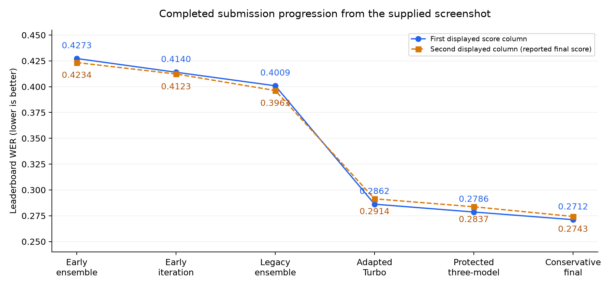
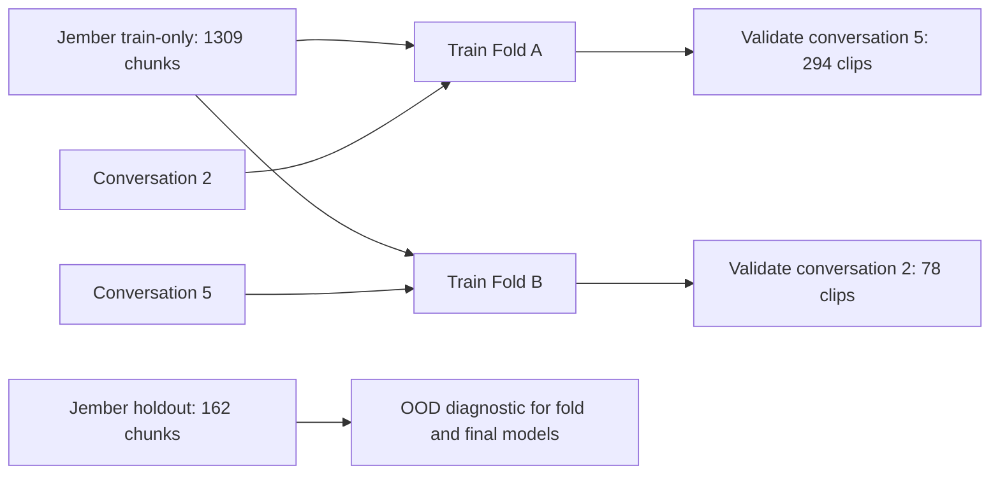
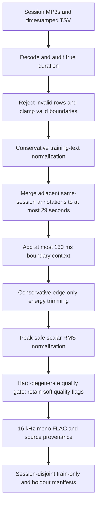
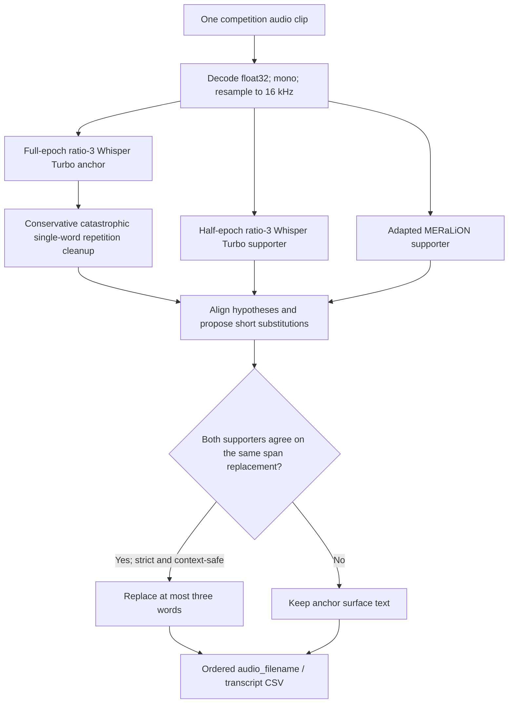
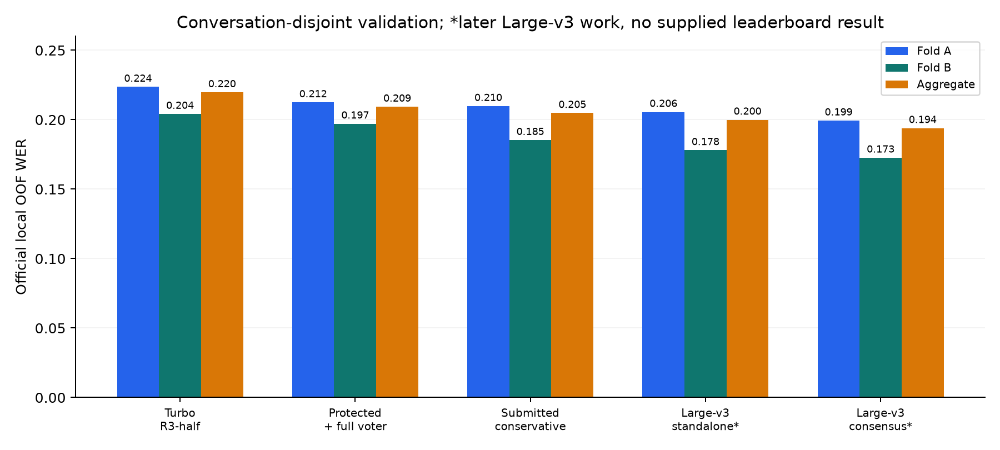

# Lost in Transcription: Building an Indonesian–Javanese ASR System from Approximately 0.43 to 0.2743 WER

**Author:** Aakash
**Project:** Indonesian–Javanese track, Lost in Transcription
**Development period:** September to early October 2026
**Case study compiled:** October 8, 2026
**Purpose:** Portfolio case study, academic report and technical documentation

## Abstract

This project addressed automatic speech recognition for spontaneous Indonesian–Javanese conversations. The challenge was to transcribe speech that switches languages within a clip, preserves colloquial vocabulary and disfluencies, and differs substantially from the available supplementary training corpus. The implementation also had to run offline within the competition's execution budget.

I initially explored a broad ensemble of pretrained ASR models, including Whisper, Qwen, XLS-R, MERaLiON and Javanese specialists. Although increasingly elaborate transcript selection improved local development scores, completed leaderboard submissions remained around 0.40–0.43 WER, and some attempts failed or exceeded the runtime limit. I then changed the approach: establish a domain-adapted Whisper Turbo anchor, validate across conversations, measure complementary errors before adding models, and permit only tightly supported corrections.

The submitted conservative system combined full-epoch Whisper Turbo, half-epoch Whisper Turbo and adapted MERaLiON. Its local out-of-fold aggregate WER was **0.204804**. The supplied submission history shows **0.2712 in the first score column and 0.2743 in the second**, which I report as the final competition result. The supplied CUDA log records successful inference in **1,840.1 seconds**, approximately **30 minutes 40 seconds**.

Further Large-v3 adaptation produced a stronger local research candidate at **0.193938 OOF WER**, but the provided final submission log matches the conservative Turbo system. This document therefore separates the achieved competition result from subsequent locally validated work. The main contribution is an evidence-driven development process spanning data auditing, domain adaptation, error-aware fusion and reproducible offline deployment, rather than a claim that the largest ensemble always performs best.

## Contents

1. [Outcome and score interpretation](#1-outcome-and-score-interpretation)
2. [Problem and execution constraints](#2-problem-and-execution-constraints)
3. [Data and domain mismatch](#3-data-and-domain-mismatch)
4. [Metric and evaluation protocol](#4-metric-and-evaluation-protocol)
5. [Preprocessing pipeline](#5-preprocessing-pipeline)
6. [Development chronology](#6-development-chronology)
7. [Models and initial ensemble experiments](#7-models-and-initial-ensemble-experiments)
8. [Why the broad ensemble could fail](#8-why-the-broad-ensemble-could-fail)
9. [Pivot to a Whisper Turbo anchor](#9-pivot-to-a-whisper-turbo-anchor)
10. [Adapting MERaLiON for complementarity](#10-adapting-meralion-for-complementarity)
11. [Protected fusion and the submitted solution](#11-protected-fusion-and-the-submitted-solution)
12. [Error examples](#12-error-examples)
13. [Large-v3 follow-on research](#13-large-v3-follow-on-research)
14. [Runtime, packaging and verification](#14-runtime-packaging-and-verification)
15. [Reproducibility and artifact map](#15-reproducibility-and-artifact-map)
16. [Limitations and interpretation](#16-limitations-and-interpretation)
17. [Contributions and lessons](#17-contributions-and-lessons)
18. [Future work](#18-future-work)
19. [Evidence and references](#19-evidence-and-references)

## 1. Outcome and score interpretation

### 1.1 Completed submission progression

The following values are transcribed from the screenshot supplied for this case study, ordered from the earliest visible completed run to the latest. Canceled and failed jobs have no scored result and are not treated as accuracy measurements.

| Completed stage | First displayed score | Second displayed score | Supported interpretation |
|---|---:|---:|---|
| Early system | 0.4273 | 0.4234 | Starting point near 0.43; exact uploaded checkpoint identity is not recovered |
| Early iteration | 0.4140 | 0.4123 | Intermediate improvement; exact archive-to-score mapping is not established |
| Legacy ensemble stage | 0.4009 | 0.3963 | Earlier project chat explicitly identifies 0.4009 as public leaderboard WER |
| Adapted Whisper Turbo | 0.2862 | 0.2914 | Single-model domain-adapted submission identified in the project history |
| Protected three-model fusion | 0.2786 | 0.2837 | Turbo half-epoch anchor, MERaLiON correction and full-epoch Turbo support |
| Conservative final submission | **0.2712** | **0.2743** | Full-epoch Turbo anchor with two-model agreement and strict substitutions |

The image is cropped above the column headers. Earlier chat establishes the public meaning of the first column, and the user identifies **0.2743 as the final result**. The second column is reproduced as the reported final score; its precise platform label is not invented from a cropped image. In particular, **0.2712 and 0.2743 are values on the same submission row, not evidence that one later model regressed from 0.2712 to 0.2743 on the same evaluation partition**.



*Figure 1. Both score columns are plotted separately. These are leaderboard measurements, not local OOF scores. Early stage names deliberately avoid assigning unverified checkpoint identities.*

Using the second column consistently, WER decreased from **0.4234 to 0.2743**, an absolute decrease of **0.1491**, or **35.21% relative WER reduction**. Using the first column consistently, the decrease from **0.4273 to 0.2712** is **36.53% relative**. “Approximately 0.43 to 0.2743” is the rounded project narrative; the same-column calculation is the more precise comparison.

### 1.2 Which system produced the reported final result?

The user identifies [the supplied CUDA log](docs/case_study/submitted_cuda_log.txt) as the latest submitted run. Its archive inventory contains:

- `models/whisper/`, `models/whisper_full/` and `models/meralion/`;
- 52 entries and **13,131,390,985 uncompressed bytes**;
- `runtime/fusion.py`, with no Large-v3 residual-loader module;
- a successful CUDA execution and `submission.csv` creation.

The local [conservative archive](artifacts/FINAL_SUBMISSION_CONSERVATIVE.zip) has exactly that entry count and uncompressed size. Its two Whisper configurations each have **four decoder layers**, identifying them as Turbo checkpoints. The later Large-v3 package has 61 entries, a `models/large/` directory, a 32-layer Whisper decoder, and an explicit LoRA-residual runtime.

This is strong artifact-level evidence that the supplied final log belongs to the conservative Turbo/MERaLiON system. The log does not contain the uploaded ZIP's SHA256, so the match is not represented as cryptographic proof of upload identity. There is no supplied leaderboard result attributable to the later Large-v3 archive.

## 2. Problem and execution constraints

### 2.1 The recognition task

The input is conversational audio in which Indonesian and Javanese can occur inside the same sentence. The desired output is a transcript matching the reference convention, including colloquial spellings, proper names, acronyms, fillers, repetitions and interrupted words. A language token such as “Indonesian” conditions a decoder; it does not partition a mixed-language waveform into monolingual sections.

The difficulty extends beyond identifying two languages. A model may recognize the broad meaning yet substitute a more standard word, normalize a colloquial expression, omit a hesitation, or write a different spelling. Each can count as a word error. Conversational pauses and incomplete phrases also make decoder repetition and premature stopping relevant.

### 2.2 Engineering requirements

The project operated against an offline code-execution interface. The package needed a root-level `main.py`, local model assets, and an output CSV with exactly `audio_filename` and `transcript`. The official runtime extracts the ZIP into `/code_execution/src/` and runs its entrypoint. [Official runtime repository](https://github.com/drivendataorg/lost-in-transcription-runtime).

The practical development constraints recorded in the project were:

| Constraint | Consequence for the implementation |
|---|---|
| Full inference budget of two hours | Model loading, I/O, decoding and fusion all count; a locally accurate system that times out is unusable |
| 2,118 clips in the earlier full-run logs | The average budget was approximately 3.40 seconds per clip including startup |
| No execution-time model downloads | Weights, tokenizers, processors, configuration and custom model code had to be bundled |
| Independent test-sample inference | No test pseudo-labeling, cross-test adaptation or reference-dependent routing |
| Development on a 16 GB Apple Silicon Mac | Microbatch 1, gradient accumulation, careful precision and sequential model residency |
| Official deployment on CUDA | Local MPS correctness and performance could not substitute for a successful platform run |
| Limited submission opportunities and late time pressure | Preserve functioning archives and use bounded experiments with explicit rejection gates |

The log provided here eventually confirms CUDA completion for the conservative system. It does not retrospectively validate every earlier archive or the later Large-v3 runtime estimate.

## 3. Data and domain mismatch

### 3.1 Audited datasets

The authoritative preparation counts below come from [the v2 manifest](processed/v2/manifest.json), rather than from older planning notes.

| Dataset/artifact | Audited size | Purpose |
|---|---:|---|
| Jember session audio | 208 MP3 sessions | Supplementary spontaneous-speech corpus |
| Original Jember annotations | 6,679 rows | Timestamped source segments |
| Structurally valid Jember annotations | 6,638 rows | Rows retained after integrity checks |
| Plain merged Jember chunks before final quality gate | 1,472 | Longer supervised examples |
| Retained Jember chunks | 1,471, approximately 9.97 hours | Versioned prepared corpus |
| Jember train-only split | 1,309 chunks | Training data used in the later adaptation phases |
| Jember held-out split | 162 chunks | Session-disjoint generalization diagnostic |
| Labelled competition clips | 372, approximately 2.54 hours | Target-domain analysis and later conversation-disjoint adaptation |
| Conversation 5 | 294 clips | Fold A validation conversation |
| Conversation 2 | 78 clips | Fold B validation conversation |

The labelled competition set contains **352 `javind` clips, 20 `ind` clips and no `jav`-only clips**. Consequently, the project could examine mixed speech and a small Indonesian subset, but could not establish pure-Javanese competition performance from this set.

The local folder is called `indonesian_dev`. Early work treated it as validation-only. Later adaptation explicitly trained on one conversation while withholding the other, and trained deployment checkpoints on all labelled competition clips plus Jember train-only data. These are different protocols, and this report records the transition rather than presenting final all-data predictions as OOF evidence.

### 3.2 Why preprocessing alone could not solve the problem

Jember and the target clips were both conversational, but differed in important ways:

| Mismatch | Observed evidence | Design response |
|---|---|---|
| Duration | Valid raw Jember segment median 5.00 seconds; target median 26.01 seconds | Merge adjacent training annotations into chunks no longer than 29 seconds |
| Spelling | Scholarly Javanese vowel marks in Jember versus predominantly everyday target spelling | Conservative training-text normalization, with explicit information-loss caveats |
| Language balance | Jember is Javanese-heavy; target conversation is Indonesian-led mixed speech | Increase target-domain sampling during adaptation rather than train on Jember alone |
| Vocabulary | Prepared Jember still leaves 3,227 of 17,485 target reference tokens out of its word vocabulary | Preserve pretrained knowledge and adapt; OOV is not a subword-model WER floor |
| Recording level | Training recordings show a much wider level distribution | Measure normalization, then choose inference treatment separately for each model |
| Conversation structure | Adjacent segment merging can introduce speaker changes | Build a turn-aware alternative, but do not assume it improves ASR without training evidence |
| Long target clips | 29 target clips exceed 30 seconds; maximum decoded duration 37.6535 seconds | Explicit native long-form inference instead of feature-window truncation |

The v2 duration table shows that merging moves the share of Jember examples in the 15–32 second band from **1.63% to 92.53%**, close to the target's **92.47%**. That is evidence of better duration matching, not an isolated causal WER ablation.

Early vocabulary analyses measured about **21.4% target word OOV**, falling to approximately **18.5%** after conservative orthographic preparation. The v2 vocabulary table records **81.544% token coverage**. This improved corpus compatibility but could not supply all Indonesian vocabulary, switching patterns or recording conditions.

## 4. Metric and evaluation protocol

### 4.1 Official-compatible WER

Word error rate was calculated as:

```text
WER = (substitutions + deletions + insertions) / reference words
```

The aggregate is a **corpus-level ratio of total errors to total reference words**. It is not the arithmetic mean of the two fold WERs. Fold A contains most target clips and words, so an aggregate-only selection can conceal damage on the smaller Fold B.

The final prepared reference denominator is **17,485 words**. A change of 0.001 WER is approximately 17–18 word errors on that corpus. Older exploratory documents quote slightly different counts because they predate the hardened preparation/scoring snapshot; their denominators are not substituted into the later phase results.

### 4.2 Text normalization is part of the measurement contract

The project retained an [official scorer snapshot](phase1_whisper_anchor/training/official_score.py) and separate [measurement utilities](phase1_whisper_anchor/training/metrics.py). The scorer handles bracketed annotations, unintelligibility markers, parenthetical wrappers, selected punctuation and sentence-initial capitalization. It does **not** lowercase all text. Hyphens, apostrophes, acronym casing and attached ellipses can remain meaningful scored distinctions.

Three text paths were deliberately separated:

| Path | Function | What must not happen |
|---|---|---|
| Training targets | Conservative corpus preparation and reference-style conversion | Do not erase fillers, repeats or important token boundaries merely to make text cleaner |
| Alignment keys | Normalize forms sufficiently to align model hypotheses | Do not emit those keys as a blanket rewritten transcript |
| Scoring | Apply the official measurement convention to reference and hypothesis | Do not replace it with a friendlier custom metric |

### 4.3 Conversation-disjoint validation



Each held-out competition clip was decoded by a checkpoint trained without its conversation. Conversation IDs were used to construct splits and report results, not as inference features. Saved predictions were aligned by exact clip identity, reference content and order before fusion comparisons.

For learned edit gates, the stronger test was **train on A, evaluate B; train on B, evaluate A**. Reference labels supplied edit outcomes only during training/analysis; inference features came from the audio and model hypotheses.

This is stronger than random clip splitting, but not a large independent validation study. There are only two competition conversations, and many design choices were repeatedly evaluated on them. Jember's holdout is session-disjoint; the corpus lacks reliable speaker IDs, so recurring speakers across sessions cannot be excluded.

### 4.4 Oracle complementarity

A clip oracle chooses, using the reference, whichever complete model hypothesis has the fewest errors. It answers whether available models make useful different mistakes. It does not provide a deployable selector and is not a word-by-word omniscient fusion result.

The working rule became: first demonstrate useful complementary hypotheses, then demonstrate that a real inference rule converts some of that headroom without damaging a fold.

## 5. Preprocessing pipeline

### 5.1 Versioned data preparation

The original notebook work was consolidated into [Preprocessing_EDA.ipynb](Preprocessing_EDA.ipynb) and a reusable [preprocessing module](src/lostintranscription_preproc.py). `processed/v1` was retained; the hardened builder produced `processed/v2` with source hashes, stage accounting, merge boundaries and manifest provenance.



### 5.2 Integrity checks and segmentation

MP3 header durations were not treated as ground truth. Sessions were decoded, and annotation boundaries were checked against the actual waveform. The builder recorded missing/invalid audio, non-positive durations, blank transcripts and starts beyond decoded audio. It removed **41 invalid rows** and clamped supported overruns instead of pairing unavailable audio with a transcript.

Adjacent annotations from the same session were merged with a **29-second maximum duration** and a **one-second maximum gap**. This regrouped 6,638 valid rows into 1,472 chunks; the reduction in row count does not mean that thousands of utterances were discarded. Source-row provenance makes the regrouping auditable.

A turn-aware boundary variant used a **6 dB adjacent level-change proxy** with a **12-second minimum chunk preference**. It generated 1,552 candidate chunks. Plain merging remained the selected preparation variant. A level jump is only a proxy for a speaker change, and the alternative's effects on recognition were not established by a controlled training ablation.

### 5.3 Text preparation

Jember preparation standardized curly quotation marks and apostrophes, mapped Unicode ellipsis to `...`, converted dash forms conservatively, removed combining diacritics and collapsed whitespace. It preserved casing, acronyms, hyphens, apostrophes and attached ellipses.

Removing a diacritic is a task-specific orthographic tradeoff, not a universally harmless cleanup operation. Some distinctions carry phonetic or dialect information. The project chose greater compatibility with the observed target annotation style and recorded that limitation. Later `to_reference_style()` preserves the already prepared text rather than introducing an unconstrained spelling rewrite.

The original target references were retained verbatim for scoring. No fuzzy vocabulary replacement, global `nggak → gak` rewrite or language-model free rewriting was added to the submitted system.

### 5.4 Audio preparation and quality flags

Prepared Jember chunks used mono 16 kHz audio and FLAC/PCM16 storage. Boundary context was capped at **150 ms per side**. Energy-based edge trimming used **25 ms frames**, **10 ms hops**, a noise-floor estimate, a **12 dB speech threshold**, **200 ms retained edge margin**, and a **one-second trimming cap**. Internal pauses were kept.

Scalar gain targeted **−23 dBFS RMS**, constrained by a **−1 dBFS peak ceiling**. There was no compressor, neural denoiser or interior-silence deletion. Scalar gain changes level; it does not intrinsically improve SNR. Quality measurements were kept distinct from claims about acoustic enhancement.

The training quality gate checked duration, estimated SNR, extreme silence and degeneracy. The v2 final gate removed **one** merged chunk, leaving 1,471. Low-SNR, off-mic and other quality flags were also emitted for later ablations; their weights were not silently turned into an active domain-selection algorithm.

Some older summaries mix v1 and v2 figures: v1 describes 1,470 retained chunks and 1,308 train chunks, while the actual later adaptation uses **v2's 1,471 and 1,309**. The case study uses the v2 manifest for the latter pipeline.

### 5.5 Training versus inference preprocessing

The submitted model did **not** apply every preparation operation to incoming competition clips.

| Stage | Prepared Jember | Submitted inference |
|---|---|---|
| Mono/16 kHz conversion | Yes | Yes, floating-point waveform |
| Timestamp-based merge | Yes | No; each input file is already a clip |
| Context from neighboring session audio | Yes, bounded | No |
| Energy edge trimming | Prepared-corpus operation | No |
| RMS normalization | Prepared-corpus operation | No for submitted Turbo/MERaLiON |
| Gain/speed/SpecAugment | Applied during later Whisper training | No stochastic test-time augmentation |
| Transcript cleanup | Conservative training targets | Minimal whitespace cleanup, then validated fusion |

The inference loader reads the **original competition audio**, averages channels and resamples to 16 kHz. Earlier Qwen experiments did retain model-specific RMS normalization because it helped that backend's local proxy. Raw audio performed better or tied for Whisper and MERaLiON, so normalization was not imposed universally.

For Whisper training, mild gain augmentation ranged from **−3 to +3 dB**. Speed choices were **0.9/1.0/1.1**, restricted to **1.0/1.1** for examples longer than 27 seconds so augmentation would not push them outside the feature window. SpecAugment was enabled in the adaptation recipe.

Labelled examples over 30 seconds were split near a low-energy midpoint for training, with transcript words divided approximately by relative time. Without word timestamps, this is approximate supervision and can create boundary-label errors. It is distinct from the native long-form inference path, which retains the whole waveform.

## 6. Development chronology

| Period | Main work | Result and decision |
|---|---|---|
| September 10 | Repository setup, data inspection, notebook EDA and hardened preprocessing | Auditable corpus and session-disjoint manifests |
| Mid-September | Whisper/Qwen/XLS-R medoid ensemble, local CTC/LM work | Small held-out advantage, large package and runtime complexity |
| September 18–21 | Javanese specialist trials, MERaLiON, routing and ROVER | Better target proxy scores; several failed/canceled/slow platform attempts |
| September 19 | CUDA input-dtype and CTC decoder API fixes | Corrected actual execution failures |
| September 21 | Batching and adaptive specialist invocation | Runtime-oriented rebuild; local tests did not by themselves prove platform completion |
| September 27–30 | Metadata-blind replay and legacy deployment audit | Local approximately 0.206 versus leaderboard 0.4009 remained unexplained |
| September 30–October 1 | Whisper Turbo LoRA across held-out conversations | Single-model leaderboard first-column score improved to 0.2862 |
| October 1 | Decoder-only MERaLiON adaptation and protected fusion | Three-model submission reached 0.2786 first-column score |
| October 1–2 | Swap full-epoch Turbo into the anchor; restrict agreement edits | Conservative system reached 0.2712 / final reported 0.2743 |
| October 2 | Stop and preserve a longer Ratio-4 Turbo attempt; pursue Large-v3 | Resumable state retained; stronger capacity experiment completed |
| October 2–3 | Soup, decoding, fusion, edit-gate and N-best checks; offline packaging | Large-v3 research candidate reached 0.193938 OOF; no supplied leaderboard attribution |
| October 8 | Reconstruct the project using chats, memory, source, reports and final evidence | This case study; no new ASR training or decoding |

The sequence involved failed experiments and corrections, not a monotonic local-score path. The early completed rows cannot all be assigned exact model hashes, and canceled/failed jobs are described as operational events rather than forced into the WER table.

## 7. Models and initial ensemble experiments

### 7.1 Why these model families were considered

Whisper provided multilingual encoder-decoder recognition, a familiar fine-tuning interface and a practical offline deployment path. Turbo retained the encoder depth while reducing decoder layers from 32 to 4, making it an attractive throughput anchor. [Whisper paper](https://arxiv.org/abs/2212.04356), [Turbo model card](https://huggingface.co/openai/whisper-large-v3-turbo).

Qwen3-ASR-1.7B was explored as a different local audio-recognition family supporting Indonesian. Its intended role was independent hypotheses, not arbitrary text correction. [Qwen model card](https://huggingface.co/Qwen/Qwen3-ASR-1.7B).

The multilingual XLS-R checkpoint offered a CTC path with an Indonesian/Javanese/Sundanese-oriented vocabulary and a supplied five-gram language model. The local greedy diagnostic differed from the intended KenLM decode because the macOS Python binding could not be built. [XLS-R checkpoint card](https://huggingface.co/panjiariputra/multilingual-xls_r_300m-LARGE-5gram).

MERaLiON was a regionally relevant speech-language model with a potentially complementary decoder. It was later adapted only after its clip oracle justified the cost. [MERaLiON model card](https://huggingface.co/MERaLiON/MERaLiON-3-3B-ASR).

Language-specific Whisper, wav2vec2 and Conformer checkpoints were investigated because a multilingual model can miss local acoustic or lexical patterns. Their language label was not sufficient evidence of suitability for this conversational target.

### 7.2 The earliest held-out ensemble

The initial weighted-medoid system combined Indonesian-conditioned Whisper Large-v3, Qwen and multilingual XLS-R. A medoid selects the candidate with the smallest weighted disagreement with the other transcripts; it does not know which candidate is correct.

| Initial measurement | Jember held-out WER, 162 clips |
|---|---:|
| Whisper Large-v3, Indonesian conditioned | 0.7237 |
| Qwen3-ASR-1.7B | 0.6611 |
| XLS-R, local greedy diagnostic | 0.7708 |
| Calibrated weighted medoid | 0.6597 |

The medoid improved over Qwen by only **0.0014** while requiring multiple model passes. These are Jember measurements, not the later 372-clip target OOF scores or leaderboard values. The distinction matters: Indonesian conditioning on a Javanese-heavy corpus and target-domain recognition evaluate different behavior.

### 7.3 Specialist exploration

The following values were recovered from retained prediction caches and rescored with the saved official-compatible scorer when preparing this case study. Each row covers the same **20 Jember holdout clips, 727 reference words**. These are screening proxies with historical decoder settings, not definitive rankings after equal tuning.

| Candidate/cache identity | WER | Decision in the broader exploration |
|---|---:|---|
| BuzzASR Javanese | 0.535076 | Best of these Jember specialist screens; later tested as a low-weight complementary voter |
| Qwen | 0.657497 | Retained as a generalist candidate in the earlier pipeline |
| Whisper Turbo, Javanese conditioned | 0.669876 | Practical generalist/specialist path |
| Whisper Large-v3, Javanese conditioned | 0.685007 | Did not establish a compelling standalone Jember result at this stage |
| Whisper automatic language | 0.696011 | Decoder alternative, not a new architecture |
| Whisper Indonesian conditioned | 0.715268 | Weak on this Jember screen |
| `johaness14/wav2vec2-conformer-rope-jv-openslr` | 0.749656 | No sufficient advantage for inclusion |
| `cahya/wav2vec2-large-xlsr-javanese` | 0.757909 | Rejected for the working ensemble |
| `bagasshw/whisper-large-v2-javanese-openslr-v2` | 0.819807 | Rejected screening candidate |
| Multilingual XLS-R / greedy | 0.837689 | No gain on this screen; duplicate decoder-cache aliases are not separate models |
| `bagasshw/whisper-tiny-javanese-openslr-v4` | 0.954608 | Rejected screening candidate |
| `bagasshw/whisper-large-v2-jv-full` | 0.982118 | Rejected screening candidate |
| `Rizka/whisper-small-jv` | 1.359010 | Rejected; insertions can make WER exceed 1.0 |

Additional caches record Buzz Indonesian, Qwen 0.6B, and `cahya/faster-whisper-medium-id` target-slice tests. Their existence is documented in the [88-cache experiment inventory](docs/case_study/cached_experiment_inventory.csv); the report does not convert tiny-slice results into competition-wide claims. The chat also records investigation of a relative-position Conformer alternative, which is not assigned a benchmark without a corresponding validated result.

### 7.4 Broad ensemble architecture

The later legacy mixed route used **Qwen + MERaLiON + Whisper Turbo**, with **Buzz Javanese** triggered when the core transcripts disagreed sufficiently. A Large-v3 Indonesian path was configured for Indonesian-only rows in some versions. The project tried whole-transcript medoid selection and word-aligned ROVER.

ROVER aligns hypotheses into a word-level voting structure. Its advantage over a medoid is the ability to combine useful pieces from different transcripts. Its danger is that plausible, correlated wrong words can win a vote and that ambiguous insertion/deletion alignment can manufacture a worse transcript.

The legacy path evolved repeatedly. Some versions routed by manifest language, some used a duration-based override, and a later diagnostic pinned all clips to the mixed route. These should not be described as one immutable architecture.

## 8. Why the broad ensemble could fail

### 8.1 What was measured

The metadata-blind replay evaluated all 372 labelled target clips through the mixed route:

| Cached target-domain diagnostic | WER |
|---|---:|
| Qwen | 0.251244 |
| MERaLiON | 0.231170 |
| Whisper Turbo, Javanese conditioned | 0.252731 |
| Buzz Javanese | 0.426137 |
| Weighted medoid | 0.222248 |
| ROVER without Buzz | 0.210237 |
| Adaptive ROVER | **0.205776** |
| Best available whole-clip hypothesis oracle | 0.196397 |

ROVER was genuinely useful locally. Buzz alone was weak but removing it worsened the ensemble. It was individually best on only six clips, yet added helpful disagreement elsewhere. This is why rejecting a model solely on standalone WER can be as misleading as adding it solely because it is different.

However, ROVER was worse than the best available candidate on **153 clips** and better on **98**. Its clip-oracle gap was about **0.0094**, suggesting limited remaining headroom from choosing among these particular transcripts. More elaborate selection would not necessarily produce substantially better hypotheses.

The replay used normalized Qwen predictions for **282 clips** and older raw predictions for **90**, because local inference stalled while completing the normalized cache. An all-raw replay scored **0.205719**, close to the mixed-cache result, but neither makes the mixed-cache comparison an exact uniform-preprocessing deployment replay.

### 8.2 What the metadata experiment ruled out

Metadata-aware replay scored **0.206177**, while forcing the mixed route scored **0.205776**. The approximately **0.0004** difference did not explain a leaderboard result of **0.4009**. Metadata routing was an engineering risk worth removing, but was not demonstrated to be the main accuracy failure.

The same caution applies to language identification and hard waveform splitting: they were proposed, but no successful measured experiment established that adding them would solve the gap. The local set had no pure-Javanese target examples and no word-level switching labels.

### 8.3 Confirmed operational issues versus plausible accuracy explanations

| Issue | Evidence status | Interpretation |
|---|---|---|
| CUDA FP16 model receiving FP32 CTC inputs | Confirmed execution failure | Fixed floating-input dtype while retaining mask types |
| Unsupported `alpha` keyword in `pyctcdecode.decode()` | Confirmed API failure | Moved LM parameters to decoder construction and corrected decode invocation |
| An early full run exceeded two hours | Recorded in project chat/platform observations | Multiple heavy passes and weak batching made the system impractical |
| Another timeout log reached only 8/2,118 clips | Recorded earlier platform-log observation | Motivated larger batches and adaptive Buzz invocation; not a final-model accuracy score |
| Legacy ZIP/source/config mismatch | Confirmed local audit | A local replay could describe code different from the uploaded archive |
| Legacy Whisper feature truncation beyond 30 seconds | Confirmed code risk | Longer clips could lose their tails |
| Old entrypoint preferred `submission_format.csv` | Confirmed code risk | Could read the wrong order/manifest if files differed |
| Distribution and annotation-style shift | Plausible, supported by corpus mismatch and tiny validation coverage | Could widen the local/leaderboard gap; not established as its exact hidden cause |
| Correlated language or spelling mistakes | Plausible mechanism with observed disagreement examples | More votes do not imply independent evidence |
| Repeated tuning on two conversations | Confirmed methodological limitation | Local improvements can specialize to a narrow sample |
| MERaLiON tokenizer warning | Observed warning, not a proven fatal fault | Processor equivalence was checked; a warning alone does not prove the score's cause |

The [legacy deployment audit](phase1_whisper_anchor/LEGACY_DEPLOYMENT_AUDIT.md) deliberately separates confirmed code risks from explanations of hidden accuracy. It would be inaccurate to claim that the ensemble's poor leaderboard result was conclusively caused by metadata, long-form handling or one tokenizer warning.

### 8.4 Why I pivoted

The next large improvement needed better domain-matched hypotheses and a simpler trusted default. A broad ensemble was spending substantial compute resolving disagreement among models that had not been adapted to the target conversation style. The pivot therefore prioritized **training a practical anchor**, **validating by conversation**, and **adding complementary models only through measurable safe corrections**.

## 9. Pivot to a Whisper Turbo anchor

### 9.1 Adaptation method

LoRA freezes the pretrained weights and learns a low-rank update. For a linear projection:

```text
W_adapted = W_base + (alpha / r) B A
```

This made local adaptation feasible while retaining the pretrained model's broad vocabulary and acoustic knowledge. The method originated in [Hu et al., LoRA](https://arxiv.org/abs/2106.09685). The actual project targets and compute behavior were established from source inspection and measured training, not inferred from that paper.

| Turbo recipe component | Implemented value |
|---|---|
| Base | `openai/whisper-large-v3-turbo` |
| LoRA rank / alpha / dropout | 32 / 64 / 0.05 |
| Target modules | `q_proj`, `k_proj`, `v_proj`, `out_proj`, `fc1`, `fc2`, across encoder and decoder |
| Trainable parameters | 27,852,800 of 836,730,880, approximately 3.33% |
| Optimizer | AdamW, learning rate 3e-4, weight decay 0.01 |
| Stability | Gradient clipping 1.0, gradient checkpointing, 8% warmup |
| Local training | MPS FP32, microbatch 1, accumulation 16 |
| Data | Competition training conversation plus 1,309 Jember train chunks |
| Sampling | Competition weights 2, 3 and 4 tested; selected ratio 3 |
| Saves | Half-epoch and full-epoch adapters |
| Decode | Indonesian, Javanese and automatic language compared |

The sampling ratio increases the draw weight of competition-domain examples. It is not a new corpus and does not turn 372 unique labelled clips into thousands of independent observations. A weighted epoch counts sampler draws, which can revisit examples.

### 9.2 Bounded experiment results

| Conditioning / ratio | Checkpoint | Fold A | Fold B | Aggregate | Jember mean |
|---|---|---:|---:|---:|---:|
| Indonesian / 3 | Half | 0.2236 | 0.2042 | 0.2197 | 0.2750 |
| Indonesian / 3 | Full | 0.2259 | 0.1890 | 0.2184 | 0.2456 |
| Javanese / 3 | Half | 0.2305 | 0.2053 | 0.2253 | 0.2778 |
| Javanese / 3 | Full | 0.2709 | 0.1842 | 0.2533 | 0.2442 |
| Automatic / 3 | Half | 0.2325 | 0.1943 | 0.2247 | 0.2922 |
| Automatic / 3 | Full | 0.2328 | 0.1873 | 0.2235 | 0.2450 |
| Indonesian / 2 | Half | 0.2423 | 0.1943 | 0.2325 | 0.2980 |
| Indonesian / 2 | Full | 0.2285 | 0.1862 | 0.2199 | 0.2621 |
| Indonesian / 4 | Half | 0.2453 | 0.1895 | 0.2340 | 0.2975 |
| Indonesian / 4 | Full | 0.2249 | 0.1808 | 0.2159 | 0.2600 |

The first deployment selected **Indonesian ratio-3 half epoch**, prioritizing the worst conversation fold. Ratio-4 full had a lower aggregate but a slightly worse worst fold. Javanese full improved B while collapsing A, illustrating why neither a forced-language assumption nor more training was accepted blindly.

The resulting single-model submission reached **0.2862 / 0.2914** in the two displayed leaderboard columns. This was the largest visible step down from the preceding **0.4009 / 0.3963** stage. It supports the practical value of domain adaptation in the project, while not isolating every accompanying preprocessing and deployment change as a separate causal effect.

## 10. Adapting MERaLiON for complementarity

The goal was not to replace Whisper with a weaker standalone model. It was to obtain a corrective hypothesis that could fix a useful subset of Whisper's errors.

| OOF system | Fold A | Fold B | Aggregate |
|---|---:|---:|---:|
| Phase 1 Whisper | 0.223634 | 0.204162 | 0.219674 |
| MERaLiON zero-shot | 0.287458 | 0.229190 | 0.275608 |
| Zero-shot Whisper/MERaLiON clip oracle | 0.191902 | 0.174634 | 0.188390 |
| Adapted MERaLiON | 0.226578 | 0.220754 | 0.225393 |
| Adapted pair oracle | **0.189245** | **0.171822** | **0.185702** |
| Adapted simple ROVER | 0.218465 | 0.215129 | 0.217787 |

The pair oracle improved substantially on both folds. Simple fusion barely improved aggregate and made Fold B worse than Whisper: **0.215129 versus 0.204162**. Complementarity existed, but blind voting failed to extract it safely.

### 10.1 Memory-efficient training recipe

MERaLiON adaptation used decoder-only LoRA with **r16/alpha32/dropout 0.05**, targeting `q/k/v/o/gate/up/down` projections. The speech encoder and audio projector were frozen, and their representations were cached. Training used AdamW at **1e-4**, ratio 3, 8% warmup, clipping 1.0, microbatch 1, accumulation 16 and gradient checkpointing.

The training code computed answer-only loss and chunked the large vocabulary projection loss to reduce memory while retaining the causal objective. Local training used MPS BF16 with CPU operator fallback.

A Fold A full-checkpoint attempt encountered nonfinite loss at **batch 945**. The usable half checkpoint at **batch 784** was retained and evaluated. The matched half recipe was then used for B and final training, with a CPU FP32 decoder retry for nonfinite examples rather than dropping them. This was recovery from a failed branch, not evidence that the full MERaLiON epoch had succeeded.

The final adapter was merged into a standalone model. Sample transcripts matched between adapter and merged inference. Processor checks covered **1,681 training texts** and preserved the trained tokenizer behavior. The Mistral regex warning was not “fixed” by changing tokenization without corresponding two-fold evidence.

## 11. Protected fusion and the submitted solution

### 11.1 From unrestricted voting to supported edits

The first protected two-model rule limited corrections to short substitutions in low-confidence Whisper regions. An existing full-epoch Turbo checkpoint supplied a third hypothesis without another model-training run.

| Phase 3 candidate | Fold A | Fold B | Aggregate |
|---|---:|---:|---:|
| Half-epoch Whisper anchor | 0.223634 | 0.204162 | 0.219674 |
| Adapted MERaLiON alone | 0.226578 | 0.220754 | 0.225393 |
| Simple fusion | 0.218465 | 0.215129 | 0.217787 |
| Protected two-model | 0.215665 | 0.203881 | 0.213269 |
| Protected plus full-epoch Turbo voter | **0.212434** | **0.197132** | **0.209322** |

The three-model candidate converted complementary hypotheses into improvements on both folds. Its first-column leaderboard score became **0.2786**, improving on Turbo-only **0.2862**.

### 11.2 Swap the stronger checkpoint into the anchor

The next experiment reused the exact same models and caches but assigned **full-epoch Turbo as the anchor**. MERaLiON and half-epoch Turbo became supporters. This removed reliance on a weaker default and allowed testing a sequence-only agreement policy without an additional acoustic-confidence pass.

Full-epoch Turbo had three catastrophic looping clips in its raw OOF predictions. The existing safeguard collapsed runs of five or more identical normalized words to two, preserving ordinary repetitions. Raw and repetition-safe baselines were reported separately.

| Final comparison | Fold A | Fold B | Aggregate | Ordinary S / I / D |
|---|---:|---:|---:|---|
| Full Turbo, raw | 0.225860 | 0.188976 | 0.218359 | Not a fusion edit count |
| Full Turbo, repetition-safe | 0.213296 | 0.188976 | 0.208350 | Separate repetition cleanup |
| Variant A: exact support, broader operations | 0.208342 | 0.185321 | **0.203660** | 157 / 21 / 17 |
| **Variant B: strict substitutions** | **0.209778** | **0.185321** | **0.204804** | **134 / 0 / 0** |
| Variant C: support plus confidence, threshold 0.80 | 0.210281 | 0.187289 | 0.205605 | 97 / 13 / 12 |

Variant B gave up **0.001144 aggregate WER** relative to A, matched A on B, applied **61 fewer word edits**, and avoided ordinary fusion insertions/deletions. It improved both folds over the repetition-safe anchor. Its 134 substitutions occupied **129 spans**. The shared repetition cleanup removed **196 repeated words** and is not hidden inside the ordinary fusion-edit totals.

The bounded confidence search tested **0.45, 0.65 and 0.80**. Missing confidence, including long clips without supported confidence extraction, could not approve an edit. The final selected substitution-only rule did not require that confidence pass.

### 11.3 Submitted architecture



The actual archive config is:

```json
{
  "anchor_model": "whisper_full",
  "third_model": "whisper",
  "cuda_batch_size": 8,
  "fusion": {
    "mode": "support",
    "max_span": 3,
    "context": 1,
    "collapse_anchor": true,
    "operations": ["substitution"],
    "strict_substitutions": true
  }
}
```

The fusion code performs minimum-edit word alignment, keeps original word positions, and identifies disagreement blocks. MERaLiON and the third Whisper hypothesis must propose the same normalized replacement for the same anchor span. A replacement has at most three words, equal source/target length, no hidden insertion/deletion in its local alignment, and at least one unchanged word of context on both sides.

Alignment compares normalized keys; the output retains the anchor surface wording outside approved replacements. MERaLiON hypotheses with substantial repetition are vetoed. If catastrophic anchor cleanup changes the word sequence, the function returns the cleaned anchor without further index-dependent edits. A single weak model never overrides the anchor alone.

### 11.4 Jember sanity check

The final conservative comparison reused the 162 session-disjoint Jember clips. Its reported Whisper rows average two fold checkpoints and pair them with the same final adapted MERaLiON predictions, so this is an OOD sanity check rather than a fully separate three-model training experiment.

| System | Jember diagnostic WER |
|---|---:|
| Full Turbo | 0.245552 |
| Half Turbo | 0.275004 |
| Adapted MERaLiON | 0.391837 |
| Variant A | 0.244655 |
| **Variant B, selected** | **0.244356** |
| Variant C, threshold 0.80 | 0.244207 |

The selected system showed no Jember collapse. C's microscopic Jember advantage did not justify its worse OOF folds and added confidence machinery. Jember was used to detect generalization problems, not treated as the competition target.

## 12. Error examples

These excerpts are recovered from saved labelled OOF predictions, not from hidden test transcripts. References appear only for retrospective analysis. They were not available to the inference-time correction rule.

| Example | Reference excerpt | Full Turbo anchor | Conservative fused result | Interpretation |
|---|---|---|---|---|
| Fold A, useful spelling correction | `beberapa kali pengen` | `beberapa kali pengin,` | `beberapa kali pengen,` | Supported correction restores the reference spelling |
| Fold B, useful word correction | `udah kayak apa sih` | `udah layak, apa sih,` | `udah kayak apa sih,` | A short aligned replacement fixes a wrong word |
| Fold A, damaging correction | `Nah, nggak seperti` | `Nah, nggak seperti` | `Nah, gak seperti` | Two models can agree on a colloquial variant that is wrong for this reference |
| Fold B, damaging correction | `gitu loh tau gak tau` | `gitu lho. Tau gak tau` | `gitu lho. Aku gak tau` | Plausible supporter agreement can replace a correct anchor word |

For the first Fold A clip, whole-clip WER decreased from **0.187500 to 0.145833**; the shown spelling change was one of its accepted corrections. For the damaging Fold A example, WER increased from **0.217391 to 0.239130**. The damaging B example increased from **0.372549 to 0.392157**.

These cases explain why agreement is useful but imperfect. `gak` and `nggak` are not interchangeable to a literal word scorer in every reference. Both folds contain correctable errors and agreement-induced damage. An aggregate gain must therefore be assessed alongside edit aggressiveness and the range of held-out conversations.

The exact four source clip identities and measurements are retained in [the error-example evidence](docs/case_study/error_examples.json); the public narrative uses short excerpts rather than publishing a full reference corpus.

## 13. Large-v3 follow-on research

This phase belongs to the research progression but is not credited with the supplied 0.2743 competition score.

### 13.1 Stronger capacity under local memory constraints

The experiment used **`openai/whisper-large-v3`**, not Turbo. It first passed a real MPS smoke gate with finite loss/gradients and approximately 6 GB driver memory. Frozen base weights were BF16; LoRA residuals remained FP32. Both encoder and decoder were adapted, with **r16/alpha32/dropout 0.05**, Indonesian conditioning, ratio 4, accumulation 16, gradient checkpointing and AdamW at 3e-4.

The public checkpoint was pinned to revision `06f233fe06e710322aca913c1bc4249a0d71fce1`, cached once and hashed. The full final run used all 372 labelled competition clips plus 1,309 Jember train chunks, with **2,797 weighted microbatches and 175 optimizer updates**. The unattended cutoff retained a partial state at batch 2,676, and the remaining 121 batches later resumed successfully.

The earlier two-epoch Ratio-4 Turbo branch was not completed. It was stopped at **batch 218/2,797** with optimizer/scheduler state, RNG/sampler state and pending accumulated gradients preserved. It has no completed new OOF or leaderboard result.

### 13.2 Half/full checkpoint and delta-soup comparison

The coefficient below is the contribution of the full-epoch adapter to an interpolation with the half-epoch adapter. Actual LoRA deltas were combined by scaled factor concatenation; averaging A and B independently would introduce unintended cross-terms.

| Full contribution | Fold A | Fold B | Aggregate | Fold-model Jember mean |
|---|---:|---:|---:|---:|
| 0.00, pure half | 0.216886 | 0.190101 | 0.211438 | 0.268351 |
| 0.25 | 0.211286 | 0.184758 | 0.205891 | 0.259755 |
| 0.50 | 0.205471 | 0.180540 | 0.200400 | 0.253476 |
| 0.75 | 0.204824 | 0.179415 | 0.199657 | 0.252429 |
| 1.00, pure full | 0.205542 | 0.178009 | 0.199943 | 0.250635 |

Full Large-v3 improved both folds relative to the submitted conservative Turbo system. The 75% soup had a slightly better standalone aggregate, while full had a better B/Jember balance. After fusion, the 75% soup beat full aggregate by only one word error, with worse B and Jember. Full was retained as the simpler supported anchor.

### 13.3 Large-v3 fusion, decoding and rejected additions

| Research candidate | Fold A | Fold B | Aggregate | Decision |
|---|---:|---:|---:|---|
| Full Large-v3 alone | 0.205542 | 0.178009 | 0.199943 | Stronger base hypothesis |
| Turbo + MER strict span support | 0.200732 | 0.174916 | 0.195482 | Useful, but weaker than selected consensus |
| Support with short insertions/deletions | 0.200804 | 0.176884 | 0.195939 | Additional risk without a gain |
| Two Turbo checkpoints supporting Large-v3 | 0.205686 | 0.178571 | 0.200172 | Regressed both folds |
| **Unambiguous aligned word consensus** | **0.199368** | **0.172666** | **0.193938** | Selected local research package |
| Cross-fold logistic edit gate | 0.200876 | 0.176040 | 0.195825 | Rejected in both directions |
| Targeted trigram N-best rescoring | 0.198937 | 0.171822 | 0.193423 | Nine-word gain; below predeclared material-gain gate |

The selected Large-v3 consensus used Turbo full and MERaLiON agreement at unambiguous word positions. It is a different implementation from the submitted Turbo span rule; their config thresholds should not be conflated. It made **277 substitutions in 267 spans**, across **173/372 clips**, with no ordinary fusion insertions/deletions.

Large-v3's clip oracles were **0.183929 with Turbo**, **0.178725 with MERaLiON**, and **0.170603 for the triple**. These remain reference-assisted diagnostics. The selected deterministic rule converted 105 word errors relative to Large-v3 alone.

Forced Indonesian and automatic-language greedy decoding produced identical transcripts on both folds. Beam 3 worsened B to **0.180259**, versus greedy **0.178009**. Its A cache remained a preserved **96/294-clip partial** at the time cap, so no full two-fold beam result is claimed. Confidence thresholds and a single cross-fold logistic recipe failed to improve both directions.

N-best was the one optional late experiment. It used a lightweight training-text trigram model only to rescore Whisper-generated candidates, not rewrite transcripts freely. It improved both folds and Jember but only by nine competition word errors, below the frozen **0.0015 aggregate-gain requirement**. It also added ordinary insertions/deletions and decoding complexity. The package retained deterministic consensus rather than relaxing the gate after seeing the result.



*Figure 2. Local OOF comparisons. Asterisks mark later Large-v3 research; this plot does not show a new measured hidden score for those packages.*

### 13.4 The OOD warning and repetition safeguard

The full final all-data Large-v3 model initially scored **0.265660** on Jember, an OOD warning despite stronger OOF performance. Analysis found that one catastrophic multiword loop dominated much of that degradation.

A fixed safeguard checked phrases of **2–6 words**, requiring **at least five cycles**, **at least 20 loop words**, and **at least 35% of the transcript**. It retained two cycles. It removed **168 loop words on one Jember clip**, changing no predictions on either OOF fold or the fold-model Jember checks across the five coefficients.

| Final all-data Jember diagnostic | Standalone | With consensus |
|---|---:|---:|
| Half Large-v3 | 0.268501 | 0.257737 |
| 75% full soup | 0.247720 | 0.242488 |
| Full Large-v3 with safeguard | **0.246524** | **0.242039** |
| Old final conservative Turbo system | Not part of this standalone row | 0.242189 |

This addressed an observed failure mode without proving a broad hidden-domain improvement. The rule was motivated by a diagnostic holdout, so its striking improvement on that same clip requires independent confirmation. It was not part of the earlier submitted Turbo package.

Original PEFT and the portable residual loader produced identical predictions in a same-batch single-clip comparison. That prediction was a valid 52-word transcript, while a historical batch-4 cache contained the 174-word loop. Batch/backend numerical differences can change recognition; fixed-batch repeat determinism does not mean all devices and batch sizes produce identical transcripts.

## 14. Runtime, packaging and verification

### 14.1 Successful submitted run

The final supplied log contains these key facts:

```text
Running submission: 2026-10-01 21:00:07.858
device=cuda
Whisper loaded
third voter loaded
MERaLiON loaded
inference complete
submission written
elapsed=1840.1
Found submission.csv: 2026-10-01 21:30:56.164
Submission run completed with exit code: 0
```

Timestamps are reproduced as logged; the container's timezone is not established. The entrypoint's **1,840.1-second** elapsed measurement differs slightly from wrapper timestamps because imports/initialization and runner overhead occur around its internal timer. It is a measured successful CUDA run, with substantial margin under two hours. The log itself does not provide independent row-level transcript or scoring analysis.

The deprecated dtype notice, duplicate logits-processor warnings and tokenizer-regex warning did not abort the run. They deserve targeted investigation, but are not evidence that a failing script caused this completed result.

### 14.2 Submission interface and model scheduling

```text
Input metadata: /code_execution/data/test_metadata.csv
Input audio:    /code_execution/data/clips/
Output CSV:     /code_execution/submission/submission.csv
Columns:        audio_filename,transcript
```

The conservative entrypoint decodes all anchor predictions, releases that model, decodes the supporting Whisper, releases it, then decodes MERaLiON and applies per-clip fusion. CUDA uses batch 8; local MPS uses batch 1. This is sequential model residency, not three large models and activation caches held in memory concurrently.

Each clip's decision uses only its own audio/hypotheses. Batching provides throughput without cross-test adaptation. Input filenames are validated, output order follows the input manifest, non-string/empty/NaN transcripts are rejected, and the CSV is written via a temporary file and atomic replacement. Logs contain operational status rather than test transcript content.

### 14.3 Long-form reliability

Whisper clips beyond 30 seconds use native long-form generation with nontruncating features and an attention mask. MERaLiON uses its native multi-chunk processor. The offline smoke fixture included a real **37.6535-second** clip, and its final eight reference words remained in the output. A normal **21.597875-second** clip was also included.

This fixes a concrete legacy truncation risk. It does not claim that every long clip is correctly transcribed, only that the tested code retains the waveform tail and produces a valid transcript.

### 14.4 Validation records

| Check | Conservative submitted-package evidence | Later Large-v3-package evidence |
|---|---|---|
| Root entrypoint and complete model assets | Passed | Passed |
| ZIP CRC and SHA256 | Passed | Passed |
| Actual extracted archive with sockets blocked | Passed | Passed |
| Empty Hugging Face caches | Passed | Passed |
| Normal and genuine long clip | Passed | Passed |
| CSV schema, row order, quoted names, no NaNs/blanks | Passed | Passed |
| Repeated identical output at tested settings | Passed | Passed |
| CUDA-first device logic | Tested | Tested |
| Actual full competition CUDA completion | **Confirmed by supplied log** | No supplied full-run log |
| Leaderboard attribution | **0.2712 / reported final 0.2743** | Not established |

The later Large-v3 package passed exact residual-loader equivalence and a recorded-loop replay through the archived entrypoint. That replay is an integration test with ASR outputs substituted at the model boundary, not a new accuracy measurement. Its projected **60–100 minute A100 runtime** was an estimate from local benchmarks and the old measured run; it remains unmeasured on A100.

### 14.5 Licenses and assets

Notices and local processor/model code accompanied the packages. Turbo's model card declares MIT; the Large-v3 checkpoint card declares Apache-2.0. MERaLiON's retained public licence includes additional referenced terms and attribution obligations, including its Gemma annex; it should not be summarized as an unrestricted interchangeable model file. [Turbo card](https://huggingface.co/openai/whisper-large-v3-turbo), [Large-v3 card](https://huggingface.co/openai/whisper-large-v3), [project MERaLiON notices](phase2_meralion/MODEL_NOTICES.md).

Ordinary Git tracked source, recipes, reports, tests and notices. Multi-gigabyte checkpoints, ZIPs, audio and per-clip reference/prediction caches remained local. This avoided accidentally turning the public repository into an unlicensed corpus mirror or an oversized binary archive.

## 15. Reproducibility and artifact map

### 15.1 Important artifacts

| Artifact | Role |
|---|---|
| [Preprocessing_EDA.ipynb](Preprocessing_EDA.ipynb) | Executed consolidated preprocessing/EDA notebook |
| [IMPLEMENTATION.md](IMPLEMENTATION.md) | Hardened v2 preparation contract |
| [src/lostintranscription_preproc.py](src/lostintranscription_preproc.py) | Integrity, text/audio preparation, merging, splitting and provenance |
| [DEV_ROUTING_DIAGNOSIS.md](DEV_ROUTING_DIAGNOSIS.md) | Metadata-blind replay and unresolved leaderboard-gap analysis |
| [phase1_whisper_anchor/](phase1_whisper_anchor/README.md) | Turbo adaptation, official scorer, folds and standalone model |
| [phase2_meralion/](phase2_meralion/README.md) | Decoder LoRA, frozen feature cache, recovery and merge evidence |
| [phase3_protected_fusion/](phase3_protected_fusion/README.md) | Protected fusion, tests, configs and archive builders |
| [FINAL_CONSERVATIVE_REPORT.md](phase3_protected_fusion/FINAL_CONSERVATIVE_REPORT.md) | Submitted-system metrics and conservative selection evidence |
| [FINAL_SUBMISSION_CONSERVATIVE.zip](artifacts/FINAL_SUBMISSION_CONSERVATIVE.zip) | Local archive matching supplied final-log inventory |
| [overnight_attack/OVERNIGHT_REPORT.md](overnight_attack/OVERNIGHT_REPORT.md) | Large-v3 training and saved half/full checkpoints |
| [FINAL_9H_REPORT.md](FINAL_9H_REPORT.md) | Follow-on soup, decoding, fusion, gate, OOD and packaging results |
| [FINAL_MAX_WER_REDUCTION_SUBMISSION.zip](artifacts/FINAL_MAX_WER_REDUCTION_SUBMISSION.zip) | Later locally validated Large-v3 consensus package; no supplied leaderboard attribution |
| [FINAL_LARGEV3_STANDALONE_BACKUP.zip](artifacts/FINAL_LARGEV3_STANDALONE_BACKUP.zip) | Later standalone Large-v3 backup |
| [phase4_stronger_anchor/RESUME.md](phase4_stronger_anchor/RESUME.md) | Stopped Ratio-4 Turbo resume instructions |

The conservative archive is **13,122,558,624 bytes**, approximately 13.12 GB, with SHA256:

```text
6001974161873a9d1cd1313cd15960aa319717f0b9d98226f9aeb11f4cbad838
```

The later Large-v3 consensus archive is **13,089,612,505 bytes**, with SHA256:

```text
93f3d6e026057830d2be8e1438dfa26425088392d62b426670bc88549e538ed8
```

The standalone Large-v3 backup is **3,203,958,580 bytes**, with SHA256:

```text
b7c2929ecfe3add896269f4f58753ad1bbc63d402b63db1ae47cee380a8ed97c
```

Archive names alone are not experiment identity. The model architecture, config, hashes and exact extracted code distinguish the submitted solution from a later “final” research package.

### 15.2 Safe reproduction commands

The following commands document existing interfaces. They were not used here to restart model training. Large data and weights must already exist locally, and a new experiment should use a new output directory.

```bash
# Validate existing v2 data without rebuilding or deleting it.
./venv/bin/python scripts/validate_preprocessing.py --version v2

# Prepare deterministic labelled fold manifests in an isolated reproduction checkout.
./venv/bin/python phase1_whisper_anchor/training/prepare_splits.py

# Run the earlier source-level regression suites.
./venv/bin/python -m unittest discover -s tests -p 'test_*.py'
./venv/bin/python -m unittest discover -s phase3_protected_fusion/tests -p 'test_*.py'

# Check the immutable conservative ZIP and hash.
unzip -tq artifacts/FINAL_SUBMISSION_CONSERVATIVE.zip
shasum -a 256 artifacts/FINAL_SUBMISSION_CONSERVATIVE.zip
```

For an already extracted conservative archive, the entrypoint supports local path overrides:

```bash
LIT_DATA_DIR=/absolute/path/to/smoke_data \
LIT_SUBMISSION_PATH=/absolute/path/to/new_output/submission.csv \
./venv/bin/python /absolute/path/to/extracted_archive/main.py
```

Official-runtime reproduction requires the matching Docker image and dependencies. A host-Python smoke check is useful but is not the same as a full official CUDA container run. Models should be loaded from the exact archive rather than whichever similarly named checkpoint happens to be in the current working tree.

### 15.3 Resumable state and preservation

The stopped Ratio-4 Turbo checkpoint is:

```text
phase4_stronger_anchor/runs/final_indonesian_x4_two_epochs/
  interrupted_epoch_1_batch_000218/
```

It preserves **13 optimizer updates**, **10 accumulated microbatches**, **464 gradient tensors**, optimizer/scheduler state, sampler indices and RNG state. Resume starts at batch 219. Earlier ratio-3 runs without optimizer/scheduler state can only support a weights-only warm start, not an exact continuation.

Large-v3 half/full runs retain adapters, prediction caches and resumable state. Preservation checks in the late package task verified five prior ZIPs and 627 overnight files unchanged. This documentation task only reads existing research artifacts and adds the case study and its supporting evidence.

## 16. Limitations and interpretation

**The final result did not meet the hoped-for 0.20 hidden WER.** The achieved 0.2743 remains a substantial improvement over the initial approximately 0.43. It does not establish that the hidden data were solved or that the best local model would win the competition.

The most important validity limits are:

1. **Small domain coverage.** Two target conversations are a narrow basis for model and fusion selection. The 20 Indonesian-only examples and absence of pure-Javanese target clips prevent broad language-specific conclusions.
2. **Repeated model selection.** OOF prevents direct training on the held-out conversation, but repeatedly selecting recipes on the same two folds can still overfit the development process. Confidence intervals or statistical significance were not established for the final differences.
3. **Unequal evidence quality.** Early 20-clip screens, 162-clip Jember tests, metadata-blind replay, conversation-disjoint OOF, smoke scores and leaderboard scores answer different questions. They are not interchangeable rows of one universal benchmark.
4. **Mixed cache and deployment identity issues.** Some early results use incomplete normalized caches; some older archive names were overwritten or stale. Exact hash/log evidence is stronger for the later conservative package than for the first two leaderboard rows.
5. **Training-boundary approximation.** Splitting long labelled clips without word timestamps can pair words with imperfect audio boundaries.
6. **Jember is a diagnostic, not the competition distribution.** Low Jember WER cannot certify hidden robustness. Repeated examination of that holdout, including a loop-inspired safeguard, also limits its independence.
7. **Batch and device variation.** Same-setting deterministic output does not guarantee equivalent recognition across MPS, CPU, CUDA or different batch sizes. Equivalence tests control the compared settings.
8. **Unresolved hidden gap.** Distribution shift, orthographic disagreement and correlated voting errors are credible mechanisms, but the exact hidden references are unavailable and no single cause is proven.

The reported final score should therefore be understood as a measured outcome of a specific submitted pipeline, with a locally supported engineering explanation for its design, rather than a post-hoc claim that every design decision caused a known hidden-score gain.

## 17. Contributions and lessons

### 17.1 What I contributed

The project demonstrates work across the full ASR development cycle: framing the code-switching problem, interrogating the training/target mismatch, specifying validation constraints, exploring model families, making evidence-based selection decisions, planning recovery and time budgets, and reviewing deployable outputs. Research, coding, experiment execution and documentation were assisted by an AI coding tool; the project history records that collaboration rather than implying every implementation detail was independently hand-written.

The concrete deliverables include a versioned corpus builder, a consolidated EDA notebook, conversation-disjoint manifests, an official-compatible scorer, adapted Whisper and MERaLiON checkpoints, conservative fusion code, resumable training state, cached experiment evidence, and offline competition archives with hashes and validation records.

### 17.2 What changed in my approach

**Model quality mattered more than ensemble size.** The single-model adapted Turbo submission produced a much larger visible leaderboard improvement than the preceding succession of increasingly complicated zero-shot ensembles.

**Complementarity needed a deployable mechanism.** MERaLiON's excellent pair oracle did not make equal-weight ROVER safe. A trusted anchor plus independently supported edits extracted useful improvements while reducing opportunities to overwrite correct words.

**The smallest local number was not always the right choice.** The submitted substitution-only variant sacrificed a small aggregate advantage to remove insertion/deletion risk. Later N-best rescoring was excluded despite a numerically better score because the gain was tiny relative to its complexity and the frozen acceptance criterion.

**Preprocessing had to be model-specific and stage-specific.** Preparing longer, consistent training chunks did not imply that trimming or normalizing every test clip helped. The project kept measurements, training targets, alignment keys and output transcripts separate.

**Runtime correctness was part of accuracy work.** Dtype mismatches, decoder APIs, archive identity, truncation and manifest order could invalidate a good model. The supplied final log shows a working CUDA execution, whereas the earlier timeouts show that a local smoke score could not establish throughput or hidden accuracy.

**Honest uncertainty made the analysis more useful.** Metadata-blind replay did not explain the leaderboard gap, and later Large-v3 OOF improvements were not a new measured competition score. Preserving those distinctions makes the work auditable and avoids turning plausible explanations into fabricated conclusions.

## 18. Future work

These are prospective experiments, not claims of completed improvements.

| Next experiment | Why it is worth testing | Evidence required |
|---|---|---|
| Evaluate the preserved Large-v3 candidate on a permitted independent target-like set | It improves both existing OOF folds but has no supplied hidden outcome | New conversation/speaker coverage, exact package identity and measured runtime |
| Reserve a genuinely untouched selection set | Repeatedly reused two-fold validation can guide overly specific choices | Split defined before the next recipe search; uncertainty estimates on held-out results |
| Better long-training alignment | Current word/time splitting is approximate | Timestamped or validated forced-alignment targets without using hidden labels |
| Explicit mixed-language error annotation | Whole-clip labels cannot identify switch-boundary failures | Manual analysis on allowed labelled data with word-level language/error categories |
| Target-compatible training diversity | Jember alone does not cover Indonesian-led mixed conversation | Licensed conversational data and controlled added-data ablations |
| Calibrated support or confidence across domains | Existing cross-fold gates failed | Improvement in both directions and on independent data, with portable inference features |
| Full CUDA regression benchmark for the exact new archive | Local timing is not platform timing | Load time, component throughput, peak memory, long clips and full completion |
| Narrow tokenizer-change experiment | A warning is not enough to justify changing trained behavior | Same-data old/new tokenization and two-fold transcript/WER evidence |

The next stage should avoid reopening a broad model search without a specific error hypothesis. The preserved predictions already support targeted comparison and leave substantial diagnostic oracle headroom for a well-validated correction policy.

## 19. Evidence and references

### 19.1 Sources reviewed for this case study

The reconstruction reviewed project notes and locally available project discussions, including the early preprocessing work. It does not reproduce private conversation dumps or claim access to unrelated/cloud conversations absent from the local project history.

| Project chat, title preserved verbatim | Contribution to the reconstruction |
|---|---|
| Validate ASR pipeline proposal | Initial preprocessing, model screens, API/dtype fixes, smoke tests, slow jobs and legacy ensembles |
| Link repo to GitHub remote | Initial repository setup |
| Create faculty preprocessing report | Historical summary and presentation scope |
| Diagnose ASR leaderboard gap | Metadata-blind replay, cache limitation and unresolved hidden diagnosis |
| Build Whisper Turbo LoRA Phase 1 | Adaptation phases, protected fusion and publication history |
| Build final submission ZIP | Anchor swap, conservative variants and selected archive |
| Train Ratio-4 Whisper anchor | Interrupted state, Large-v3 follow-on work and final-result documentation request |

Primary local experiment records include [the v2 manifest](processed/v2/manifest.json), [Phase 1 report](phase1_whisper_anchor/PHASE1_REPORT.md), [Phase 2 report](phase2_meralion/PHASE2_REPORT.md), [Phase 3 report](phase3_protected_fusion/PHASE3_REPORT.md), [conservative selection report](phase3_protected_fusion/FINAL_CONSERVATIVE_REPORT.md), [overnight report](overnight_attack/OVERNIGHT_REPORT.md), and [nine-hour report](FINAL_9H_REPORT.md). Their source hashes and the archive/log inventory comparison are recorded in [the evidence manifest](docs/case_study/evidence_manifest.json).

The user's [original screenshot](docs/case_study/leaderboard_progression.png) supplies the exact two-column submission progression. The [copied final CUDA log](docs/case_study/submitted_cuda_log.txt) supplies runtime/completion evidence. The [cached experiment inventory](docs/case_study/cached_experiment_inventory.csv) records 88 retained prediction tables, their evaluated coverage, official-compatible WER and hashes. No ASR predictions were regenerated while writing this report.

### 19.2 Primary technical references

- Radford et al., [Robust Speech Recognition via Large-Scale Weak Supervision](https://arxiv.org/abs/2212.04356). Background for Whisper's multilingual recognition approach.
- Hu et al., [LoRA: Low-Rank Adaptation of Large Language Models](https://arxiv.org/abs/2106.09685). Background for low-rank parameter adaptation.
- OpenAI, [Whisper large-v3-turbo model card](https://huggingface.co/openai/whisper-large-v3-turbo). Turbo architecture and declared license.
- OpenAI, [Whisper large-v3 model card](https://huggingface.co/openai/whisper-large-v3). Follow-on base checkpoint and declared license.
- Qwen, [Qwen3-ASR-1.7B model card](https://huggingface.co/Qwen/Qwen3-ASR-1.7B). Earlier independent recognition candidate.
- MERaLiON, [MERaLiON-3-3B-ASR model card](https://huggingface.co/MERaLiON/MERaLiON-3-3B-ASR). Speech-language model source.
- Panji Ariputra, [multilingual XLS-R with five-gram LM](https://huggingface.co/panjiariputra/multilingual-xls_r_300m-LARGE-5gram). Earlier CTC/LM candidate.
- DrivenData, [Lost in Transcription runtime](https://github.com/drivendataorg/lost-in-transcription-runtime). Official packaging and execution interface.

External documentation was checked when compiling this report. Historical project results remain tied to the saved local snapshots and experiment evidence; later upstream documentation is not substituted for the historical runtime configuration.

### Portfolio description

Developed an offline Indonesian–Javanese conversational ASR system through dataset auditing, domain adaptation and conservative error-aware fusion. Reduced the reported final leaderboard WER from **0.4234 to 0.2743**, a **35.21% relative reduction**. Built versioned preprocessing, conversation-disjoint validation, Whisper Turbo and MERaLiON LoRA adaptation, and a three-model agreement policy that ran successfully on CUDA in approximately **31 minutes**. Subsequent Large-v3 research achieved **0.193938 local OOF WER**, documented separately from the measured competition result.
